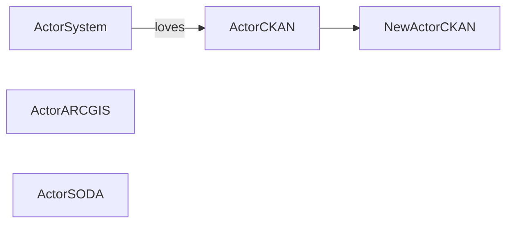
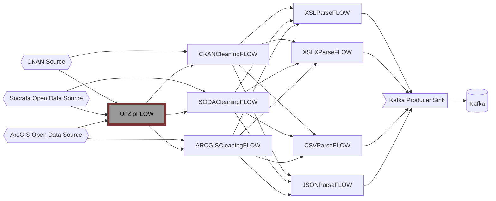

## Stream Flow Architecture

Hello here is a markdown document

```mermaid

flowchart LR
  ActorSystem
  NewActorCKAN
  ActorARCGIS
  ActorSODA

  ActorSystem -- loves --> ActorCKAN --> NewActorCKAN

```

## This is a markdown document

```mermaid

flowchart LR
  KafkaProducerSink> Kafka Producer Sink]
  CKANSource{{CKAN Source}}
  SODASource{{Socrata Open Data Source}}
  ARCGISSource{{ArcGIS Open Data Source}}
  CKANCleaningFLOW
  SODACleaningFLOW
  ARCGISCleaningFLOW
  XSLParseFLOW
  XSLXParseFLOW
  CSVParseFLOW
  JSONParseFLOW
  UnZipFLOW
  style UnZipFLOW fill:#999,stroke:#733,stroke-width:6px,color:#000


  Kafka[(Kafka)]

  KafkaProducerSink --> Kafka
  Kafka
  CKANSource --> CKANCleaningFLOW
  SODASource --> SODACleaningFLOW
  ARCGISSource --> ARCGISCleaningFLOW
  UnZipFLOW --> SODACleaningFLOW
  UnZipFLOW --> CKANCleaningFLOW
  UnZipFLOW --> ARCGISCleaningFLOW
  CKANSource --> UnZipFLOW
  SODASource --> UnZipFLOW
  ARCGISSource --> UnZipFLOW
  CKANCleaningFLOW --> XSLParseFLOW
  CKANCleaningFLOW --> XSLXParseFLOW
  CKANCleaningFLOW --> JSONParseFLOW
  CKANCleaningFLOW --> CSVParseFLOW
  SODACleaningFLOW --> XSLParseFLOW
  SODACleaningFLOW --> XSLXParseFLOW
  SODACleaningFLOW --> CSVParseFLOW
  SODACleaningFLOW --> JSONParseFLOW
  ARCGISCleaningFLOW --> XSLParseFLOW
  ARCGISCleaningFLOW --> XSLXParseFLOW
  ARCGISCleaningFLOW --> CSVParseFLOW
  ARCGISCleaningFLOW --> JSONParseFLOW
  XSLParseFLOW --> KafkaProducerSink
  XSLXParseFLOW --> KafkaProducerSink
  CSVParseFLOW --> KafkaProducerSink
  JSONParseFLOW --> KafkaProducerSink


```